# Face Mask D&R
### Face mask Detection & Actors Recognition<br>
<p align="center">
  
</p>

### Index

1. [**What is FMD&R?**](#what-is-fmdr)
2. [**System Dependencies**](#requirements-and-dependencies)
3. [**Quick Start**](#quick-start)
4. [**How it Works**](#how-it-works)
5. [**Evaluation and Results**](#evaluation-and-results)
6. [**Conclusions**](#conclusions)
7. [**Credits**](#credits)

<ul>


## What is fmdr

**FMD&R** is an application developed for an "Agent Systems" exam 
at **University Aldo Moro** of Bari Italy. <br>
its goal is to detect face mask on images of faces and eventually recognize: <br>
'Andrew Garfield', 'Angelina Jolie', 'Anthony Hopkins', 'Ben Affleck', 'Beyonce Knowles'
with or without face mask protections

### Extra Functionalities
<ul>

<li>
    Google Scraper:<br>
    Google scraper is a script that uses a special library to be able 
    to download google images related to certain keywors. 
    This library proved to be useful for obtaining further images 
    of the reference actors for the purpose of creating a test 
    dataset containing images different from those used in the 
    training stage of the classifiers
</li>

<li>
    Wear Mask:<br>
    wear mask is a script useful for creating a dataset containing 
    images of faces to which a facial mask has been affixed. 
    This script proved to be very useful in order to train 
    the classifier to recognize faces with the mask. 
    it is based on the use of Dlib to be able to identify 
    the facial points useful for identifying the coordinates 
    where the mask should have been (nose, mouth and chin)
</li>

</ul>


<li>

## Requirements and Dependencies
```
Python 3 or higher (tested on 3.7)
opencv-python~=4.2.0.34
dlib~=19.19.0
numpy~=1.18.2
Pillow~=7.1.1
Keras~=2.3.1
utils~=1.0.1
matplotlib~=3.2.1
seaborn~=0.10.1
scikit-learn~=0.22.2.post1
mtcnn~=0.1.0
face_recognition
keras-vggface
 ```  

</li>
<li>

## Quick Start

1 - Clone this repository <br> 
2 - Install all dependencies with "pip3 install -r requirements.txt" <br> 
3 - Execute "main.py" <br>
4 - Enjoy with **Face Mask D&R** <br>

</li>
<li>

## How it works
Project Presentation inside "/doc/Presentazione FMDR.pptx" <br>
___
#### 1) Mask Detection <br>
___
This project trains a CNN to detect the presence of a face mask in a face image.
CNN is trained on a dataset containing faces with and without a mask.
The script is able to start via command line on images, videos and webcams
<br>
<br>
INSERIRE GIF

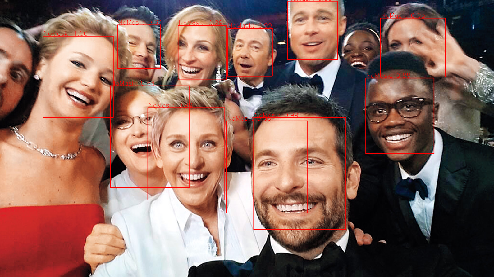
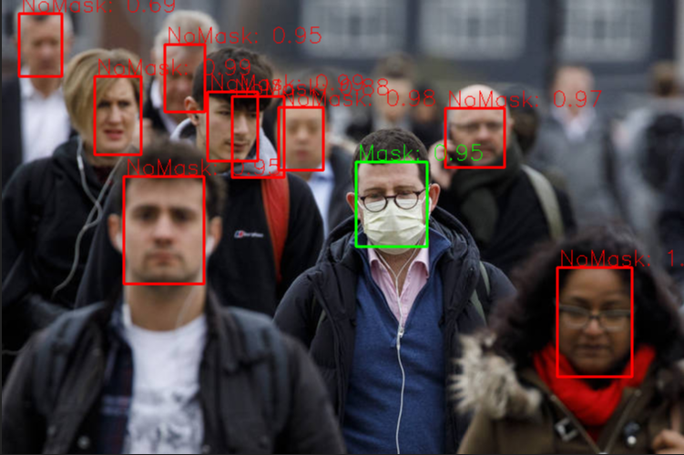
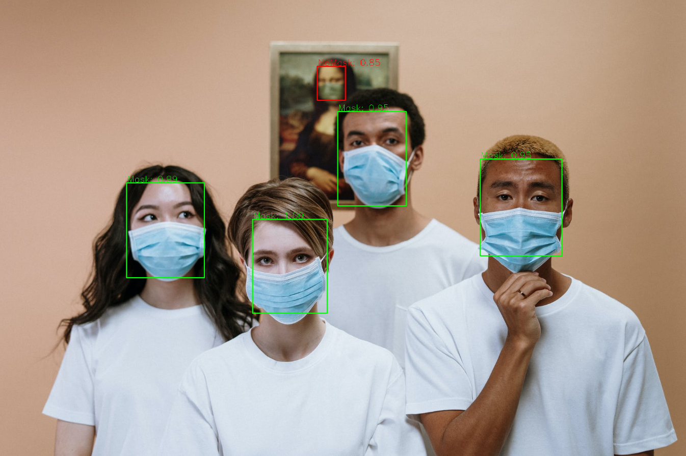


#### 2) Mask Cropper <br>
___
this script processes the images returned by WeraMask.py, 
subtracts the color of the face mask and identifies the cut
 point that separates the image into two sections: eye line section
 (useful for recognizing the subject) and the "artificial" mask section
<br>
<br>
INSERIRE IMMAGINI SOTTRAZIONE COLORE E EYE LINE
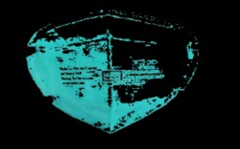


#### 3) Face Recognition <br>
___
This project based on the pre-trained classifier VGG16 is able to 
fine-tune the images of the dataset containing only the faces of 
the actors, and make a prediction on which of the 5 actors it can be.
<br>
<br>
INSERIRE IMMAGINI

#### 3) Masked Face Recognition <br>
___
This project based on the pre-trained classifier VGG16 is able to fine-tune 
the images of the dataset containing only the eye line returned by 
MaskCropper.py. He is therefore able to recognize the identity of the 
image provided between one of the 5 masked actors used.

**Andrew Garfield**<br>

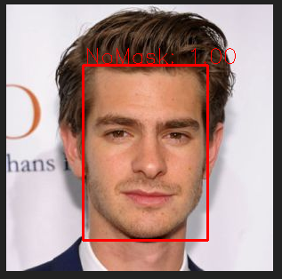<br>
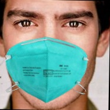


___
**Angelina Jolie**<br>

<br>
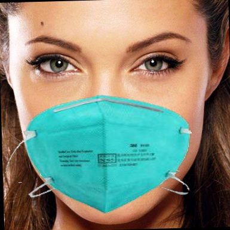


___
**Antony Hopkins**<br>

<br>

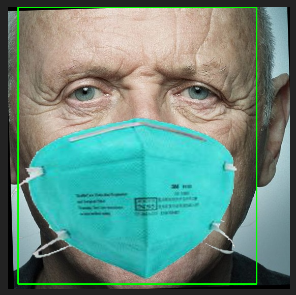

___
**Ben Affleck**<br>

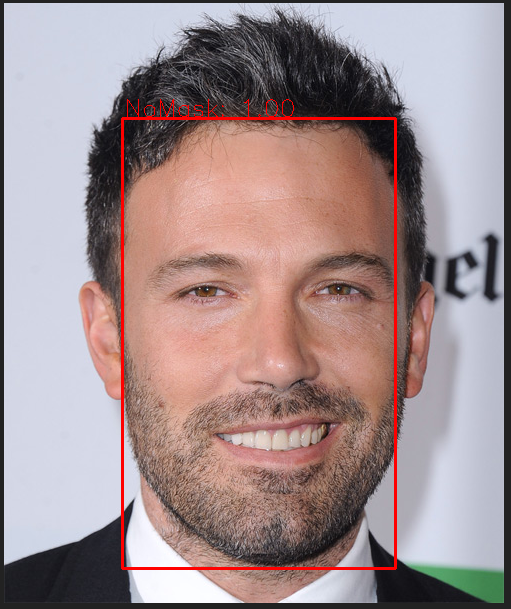<br>
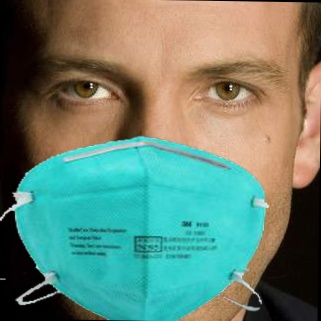


___
**Beyonce**<br>
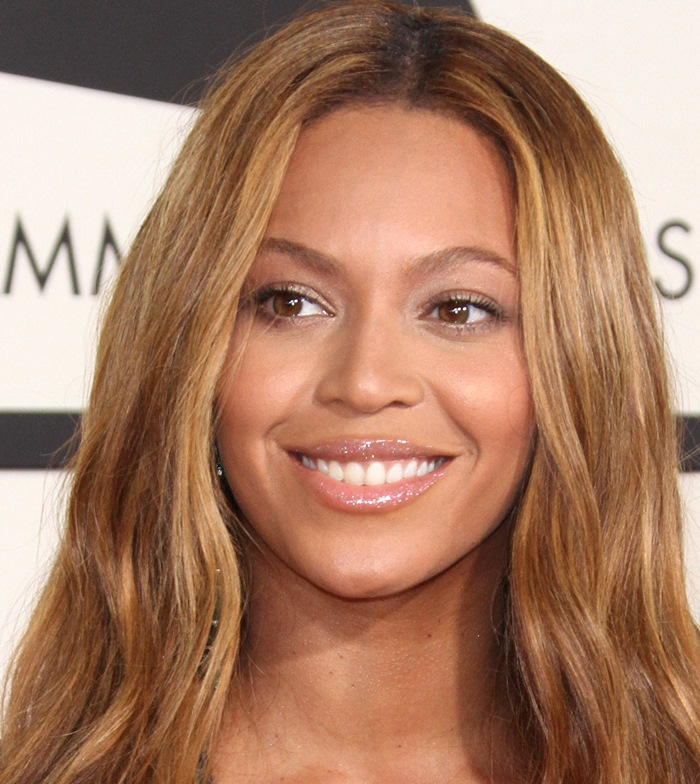
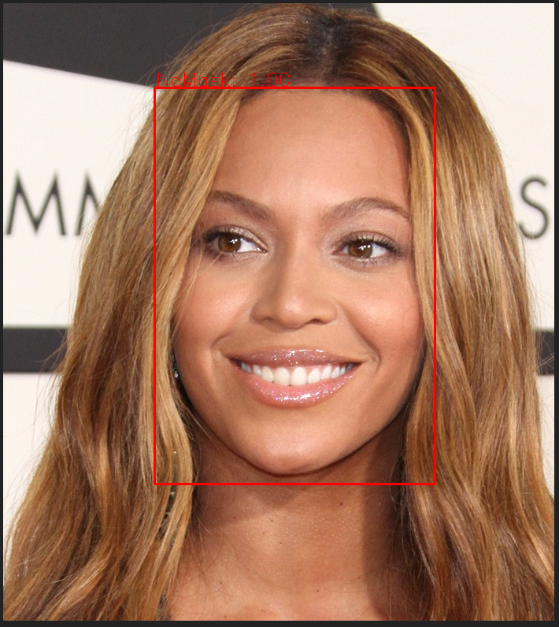<br>
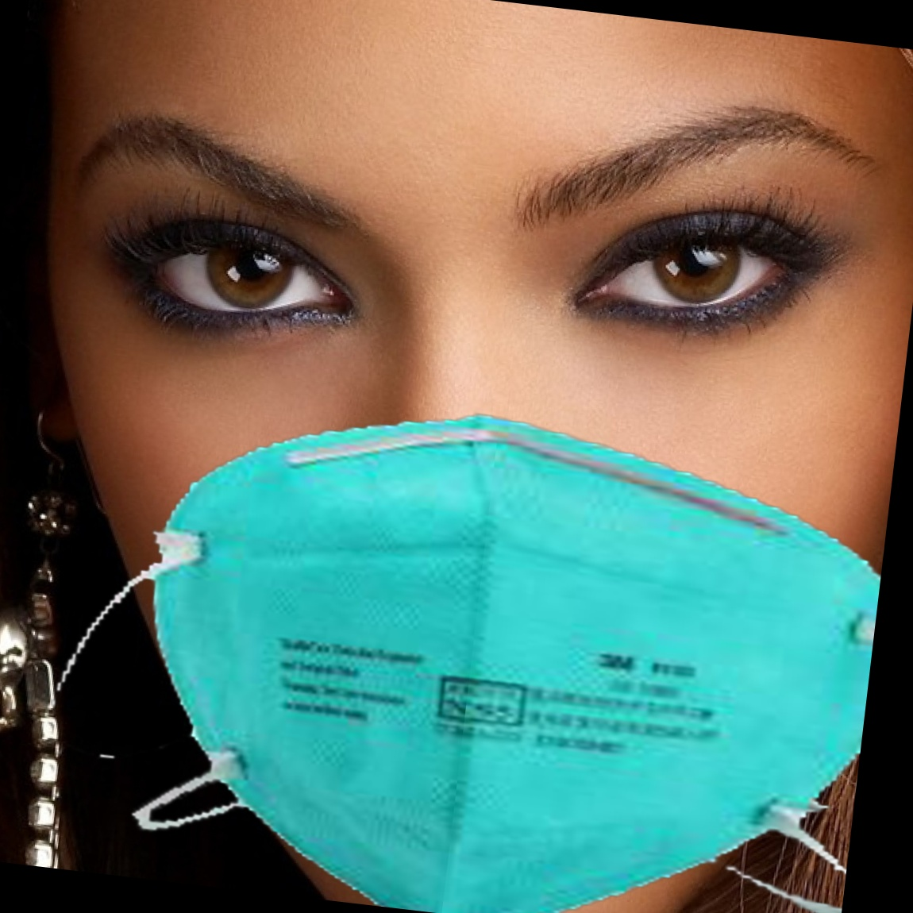
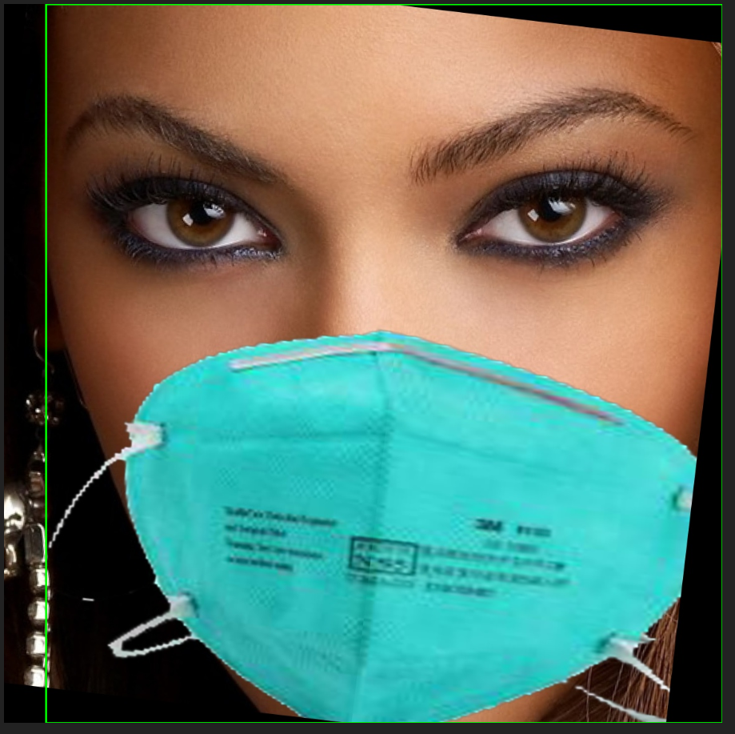
</li>


<li>

## Evaluation and Results

#### VGG16 results on Actor clean faces Recognition
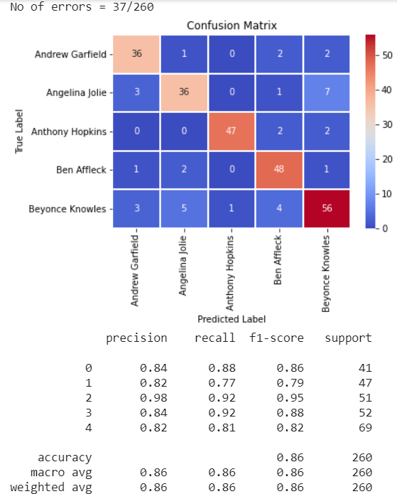
<br>

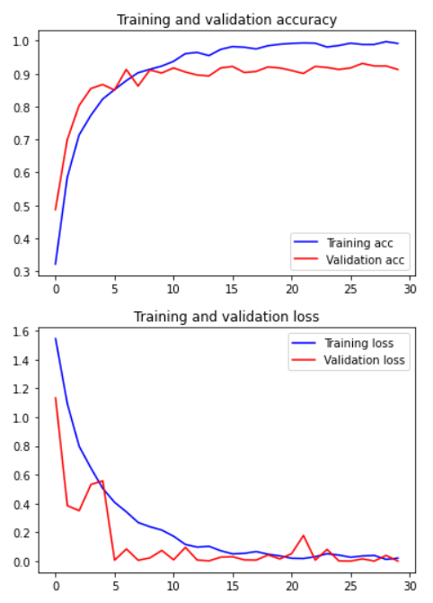
<br>

#### VGG16 results on Actor masked faces (EyeLinesCrop) Recognition
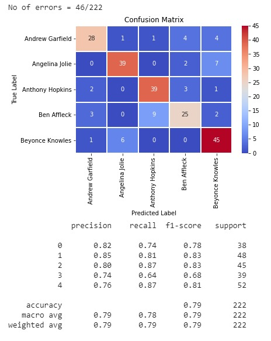
<br>


<br>

</li>


<li>

## Conclusions and future develop

</li>

**X** <br>
XXXX


<li>
	
### Credits

**Developed and Designed by:**

[**Chrism1c**](https://github.com/Chrism1c)**,**
[**mpia3**](https://github.com/mpia3) **and**
[**mircocrit**](https://github.com/mircocrit)

</li>
</ul>

